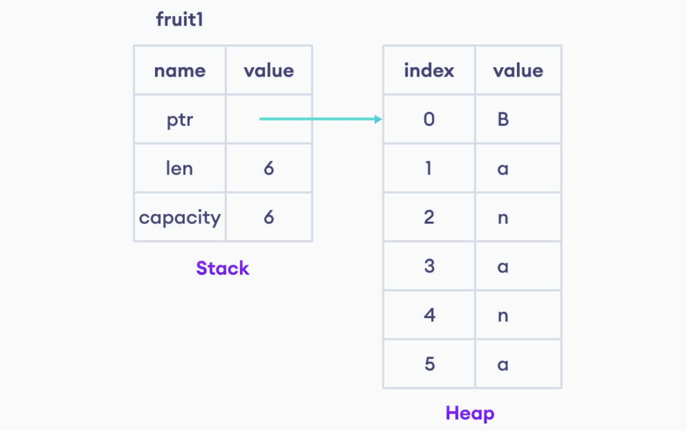
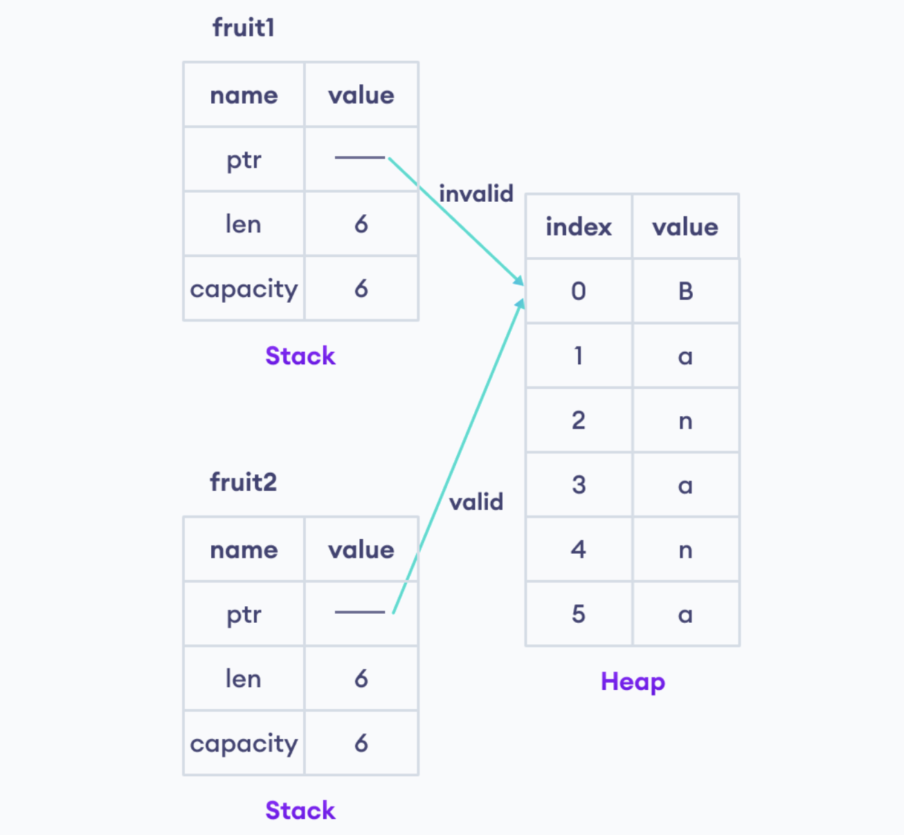

# Rust General Concepts : 

## Printing Output : 
* For printing text we can use `print!()` or `println!()` macro.

```Rust
fn main(){
    println!("This is print statement!");

}
```
### Print variable : 

* for printing variable we will be using `{}` curly braces to fetch the variables.

```Rust
fn main(){
    let age = 20;   // variable 
    let money = 100000;

    print!("your age is {} & you have {}$ in your account", age, money);    // we can fetch by order.
    print!("your age is {age} & you have {money}$ in your account"); // we can fetch value with just writing name of variable.
    print!("your age is {1} & you have {0}$ in your account", money, age);      // we can fetch value with using index.
    print!("Rust is fun! \n I love Learning Rust"); // we can use \n \t etc...
}
```


## Rust Variables & Mutability : 

```Rust
fn main(){

    let x = 1;  // immutable variable
    let mut y = 3;  // mutable variable 
    y = 5;
}
```
* By default rust create every variable as immutable, means once it's declare we can't change the value of it..

* With using `mut` Keyword during variable declaration we can make our variable as mutable.
  
### Rules for naming Variables in Rust : 

* During Naming of variables we need to take care of special character, naming_Cases, numbers etc...

```rust 
// Variables must start with either letters or an underscore
    let age = 30;       // valid and good practice
    let _age = 30;       // valid variable
    let 1age = 30;       // Invalid variable

// Variables names can only contains letters, digits and an underscore character.
    let age1 = 30;       // Valid variable
    let age_num = 30;       // Valid variable
    let S@lary = 30;       // Invalid variable

// use underscore if we need to use two words as variable names.
    let first name = "jack"     // Invalid Variable
    let first_name = "jack"     // Valid Variable
    let firs- name = "jack"     // Invalid Variable

```

### Rust Constants : 

* Constants is a special type of variable whose value cannot be changed.

```rust
fn main(){
    // declare a float constant
    const PI: f32 = 3.14;
    print("value of PI  = {}", PI);
}
```


## Rust DataType : 

* We will have mainly four primary data type in rust : 
  * Integer
  * Floating-Point
  * Boolean
  * Character

### 1. Integer Type :

#### Signed Integer Type : 

```rust
    let number: i32 = 200;  // here we can use signed value like : positive & negative values.
    let num1: i32 = -200;
```
* `:` This colon acts as a separator, indicating that the type of the variable is about to be declared.
* `i32` This specifies that num will hold a 32-bit signed integer value.
* Here `i` : integer
* `32` is size of the integer

#### Unsigned Integer Type :

```rust
    let number: u32 = 200;
    let number: u32 = -200; // this will generate error.
```
* For unsigned integer it will take only positive value.
* Negative value here will generate error.

#### Categories of Integer Data Types in Rust : 


|   Size    |   Signed  |   Unsigned    |
|-----------|-----------|---------------|
|   8-bit   |    i8     |    u8         |
|   16-bit  |    i16    |    u16        |
|   32-bit  |    i32    |    u32        |
|   64-bit  |    i64    |    u64        |
|   128-bit |    i128   |    u128       |


### 2. Rust Floating Type : 

* Floating point type are used to store fraction (numbers with decimal pints).
* In rust Floating type can be divided into : 
  * `f32` : for 32-bit floating value.
  * `f64` : for 64-bit floating value.

```rust
    let x: f32 = 3.1
```

```Rust
fn main(){
    // f32 floating pint type
    let x: f32 = 3.1;

    // f54 floating point type
    let y: f63 = 43.000232;

    println!("X = {}", x);
    println!("Y = {}", y);
}
```
* Note : 
  * `f32` is used for single-precision floating type whereas `f64` is double-precision type. With double-precision `f64` can store data with larger decimal range and is considered more precision.

### 3. Rust Boolean Type : 

* In rust, a boolean data type have two possible values: `true` or `false`. For example,

```rust
fn main(){
// boolean value true
    let flag1: bool = true;
// boolean value false
    let flag2: bool = false;

    println!("flag 1 : {0}\nflag 2 : {1}", flag1, flag2);
}
```
### 4. Rust Character Type : 

* Character data type in Rust is used to store single character. For example, 

```rust
fn main(){
    // char type : 
    let value: char = 'z';

    println!("character = {}", value);
}
```
* the value will be store in single quotes.
* Here, `char` represent the character type and we use single quote to represent a character. 
* We can also store special character like `$`, `@`, `&`, etc. using the character type. 

* Note : we can also store the number as character using single quotes. for example : 
```rust
    let num_char: char = '5';
```

### Type Inference in Rust 

* So far we have mentioned the data type during the variable declaration. However, in Rust we can create variable without mentioning a datatype. For example : 

```rust
fn main(){
    let x = 51;
    println!("x = {}", x);
}
```
* In this case, Rust automatically identifies the data by looking at the value of the variable `x` and associate it with the variable. This process is known as `Type Inference`.


## Rust Type Casting :

* Type casting allows us to convert variable of one data type to another. In Rust, we use the `as` keyword to perform type casting. For example,

```rust
fn main(){

    // Create a floating-Point Variable
    let decimal: f64 = 23.2343;
    
    // converting floating point type to integer type 
    let integer = decimal as u16;
    
    println!("Decimal = {}", decimal);
    println!("Integer = {}", integer);
}
```

### Type conversion: Character to integer in Rust

```rust
fn main(){
    let character: char = 'A';
    // convert char type to u8;
    let integer = character as u8;

    
    println!("character = {}", character);
    println!("integer = {}", integer);

}
```
* Output : 
  
```plain
character = A
integer = 65
```

* Here we have convert `char` type to `u8` integer type, in output we have seen that the vale for `A` is `65`, this value is ASCII value.
* ASCII : American standards code for information interchange, Every character has some ASCII value.

### Error while Converting integer to character : 

* Rust allows `u8` integer size only.

```rust
fn main(){
    let integer: i32 = 65;

    // converting integer to char using as keyword
    let character = integer as char;

    println!("Integer = {}", integer);
    println!("Character = {}", character);
}
``` 

* Here we got an error in output :

```plain
error[E0604]: only `u8` can be cast as `char`, not `u32`
 --> src/main.rs:8:21
  |
8 |     let character = integer as char;
  |                     ^^^^^^^^^^^^^^^
  |                     |
  |                     invalid cast
  |                     help: try `char::from_u32` instead: `char::from_u32(integer)`

For more information about this error, try `rustc --explain E0604`.
error: could not compile `guessing_game` (bin "guessing_game") due to previous error
```
* If we go on `rustc --explain E0604` we will know that, char is unicode scalar value, Unicode scalar value are small integer number & fit in the range of `u8` `unsigned 8-bit`.
  
### Type Casting: Boolean to integer in Rust 

```rust
fn main(){
    let boolean1: bool = false;
    let boolean2: bool = true;

    // convert boolean type to integer
    let integer1 = boolean1 as i32;
    let integer2 = boolean2 as i32;
}
```

* Here `False` will convert to value `0`, & `True` will be `1`.

### Limitation of Type Casting : 

* There are limitations while performing type casting in Rust. Not all datatype are converted to one another.

* example : we can't covert `floating` to a `character`.

```rust
fn main(){
    let decimal: f32 = 65.2133;

    // convert float to char
    let character = decimal as char;
    
    println!("decimal = {}", decimal);
    println!("character = {}", character);
}

```
* output generate error : 

```plain
error[E0604]: only `u8` can be cast as `char`, not `f32`
 --> main.rs:5:19
  |
5 |   let character = decimal as char;
  |                   ^^^^^^^^^^^^^^^ invalid cast
```


## Rust Operators : 

* Operators are Symbols that performs operations on value or variable
* Rust programming provides various operators that can be categorized into the following major categories : 
  * Arithmetic Operator 
  * Assignment Operator
    * Compounding Assignment Operator 
  * Logical Operators 
  * Comparison Operators 

### 1. Arithmetic Operator in Rust : 


|       Operators    |  Example   |
|--------------------|------------|
|   `+` ( Addition ) |  `a + b`   |
|   `-` ( Subtraction ) |  `a - b`   |
|   `*` ( Multiplication ) |  `a * b`   |
|   `/` ( Division ) |  `a / b`   |
|   `%` ( Remainder ) |  `a % b`   |


### Assignment Operator : 

```rust
let mut x = 1;
```
#### Compound Assignment Operator : 


|       Operators    |  Example   | Equivalent To   |
|--------------------|------------|---------|
|   `+=` ( Addition assignment ) |  `a += b`   | `a = a + b` |
|   `-=` ( Subtraction assignment) |  `a -= b`   | `a = a - b` |
|   `*=` ( Multiplication assignment) |  `a *= b`   | `a = a * b` |
|   `/=` ( Division assignment) |  `a /= b`   | `a = a / b` |
|   `%=` ( Remainder assignment) |  `a %= b`   | `a = a % b` |

```rust
    let mut x = 1;
    // compound assignment operator
    x += 3;   // equivalent to x = x + 3
```

### Comparison Operator :

* We use Comparison operator to compare two values or variable. for example,

```rust
    6 > 5
```
* Here, the relation operator `>` (greater than) checks if `6` is grater than `5`. 
* A relation operator returns : 
  * `true` if the relation b/w two value is correct.
  * `false` if the relation is incorrect.

* `NOTE` : Relation operator is also known as Comparison operator.

| Operator | Example | Description |
|----------|---------|-------------|
| `>` (Greater than)    |   `a > b` |   `true` if `a` is grater than `b` | 
| `<` (Less than)    |   `a < b` |   `true` if `a` is less than `b` | 
| `>=` (Grater than or equal to)    |   `a >= b` |   `true` if `a` is grater or equal to `b` | 
| `<=` (Less than or equal to)    |   `a <= b` |   `true` if `a` is Less or equal to `b` | 
| `<=` (Less than or equal to)    |   `a <= b` |   `true` if `a` is Less or equal to `b` | 
| `==` (Equal to)    |   `a == b` |   `true` if `a` is equal to `b` | 
| `!=` (Not Equal)    |   `a != b` |   `true` if `a` is not equal to `b` | 

### Logic Operators :

* We use logical operators to perform logical decision decisions or operations. 
* Result will be in `true` or `false`, depending on the conditions. For example : 
```rust
(5 < 6) && (7 > 4)
```
* This will result `true`, as both the condition are true.
* There are mainly 3 logical operators in Rust.

| Operator  | Example   |   Description |
|-----------|-----------|---------------|
|   `&&` ( logical AND )    | `exp1 && exp2`    |   returns `true` if both `exp1` and `exp2` are `true` |
|   `\|\|` ( logical OR )    | `exp1 && exp2`    |   returns `true` if any one `exp1` or `exp2` is `true` |
|   `!` ( logical OR )    | `!exp`    |   returns `true` if expression is `false`, if it is `true` |

* `Note` : logical `AND` and `OR` operator are also called short-circuiting logical operators because these operators don't evaluate the whole expression in these case they don't need to. For example, in this expression
```rust
false || true || false
```
* The `||` operator evaluates to `true` because once the compiler sees a single `true` expression, it skips the evaluation and return `true` directly.


## Rust if..else : 

### Boolean Expression

* Before we learn about `if..else` expression, let's quickly understand boolean expression.
* Boolean expression is an expression which return the value either `true` or `false` as the output.

```rust
fn main(){
    let x = 7;

    // example of boolean expression
    let condition = x > 5;

    println!("{}", condition)
}
```
* output will be `true`.

### Rust if : 

```rust
    if condition{
        // block to execute
    }
```
* If the condition evaluates to : 
  * `true` - the code inside the `if` block is executed.
  * `false` - the code inside of the block is not executed.

```rust
fn main(){
    let number = 10;

    // condition to check if number is grater than zero
    if number > 0 {
        println!("{} is grater than 0", number);
    }
    println!("End of program");
}
```
* Here we don't use parenthesis like c, c++ or other language to specify condition inside it, although it will run, but cargo considered it as bad practice.
* however, when we write multiple & complex condition it's good to specify the condition in parenthesis, so that the readability is increased...

### Rust if..else Expressions

```rust
if condition {
    // execute when the condition is true
} else {
    // execute when the condition is false
}
```

### Rust if..else if Expressions 

* We can evaluate **multiple conditions** by combining `if` and `else` is an `else if` expression.

```rust
if condition1 {
    // code block 1
} else if condition2 {
    // code block 2
} else {
    // code block 3
}
```

*  if `condition1` is true then `condition2` and `code block 3` is skipped.
*  if `condition2` is true then `condition1` and `code block 3` is skipped.
*  if `condition1` and `condition2` are false, then  `code block 3` is executed.

### Nested if..else

* We an use `if..else` expression inside the body of other `if..else` expression. it is known as nested `if..else` in Rust. example,

```rust
fn main(){
    let number = -2;

    if number < 0  {
        if number  ==  -2 {
            println!("the current number is -2");
        } else {
            println!("the current number is {}", number);
        }
    } 
}
```


## Rust Loop :

* In rust we have three different keywords to execute a code block multiple times:
  * `loop`
  * `while`
  * `for`

### Rust Loop Expression

* In Rust, we use the `loop` expression to indefinitely execute a block of code. if we use a `loop`, the code execution inside of the loop code block doesn't stop and runs forever. example,

```rust
fn main(){
    // loop expression
    loop {
        println!("Loop forever!");
    }
}
```

* This example code will print **Loop forever!** indefinitely unless the user terminates the program. Since the loop runs forever, it is also known as an infinite loop.

#### Terminating loop in rust : 

* we can use some `counter` with some condition to break out from loop, or we can use `break` keyword to break the loop execution.

* **NOTE:** In Rust, we often user a loop `loop` and `break` together

* Example : Print first 10 natural number.

```rust 
fn main(){
    let mut num = 1;
    loop{
        if num == 11 {
            break;
        }
        println!("{}",num);
        num += 1;
    }
} 
```

### Rust while loop Expression 

* We use the `while` loop to execute a code block till the condition is `true`. The syntax for the `while` expression is : 

```rust
    while condition {
        // code block
    }
    // code block outside while loop
```

* Here, until the condition is `true`, loop will execute the block of code again and again.

* Example : printing table of 20

```rust
fn main(){
    let num = 20;
    let mut cnt = 1;
    while cnt <= 10 {
        println!("{} x {} = {}", num, cnt, num*cnt);
        cnt += 1;
    }
} 
```

#### Nested while loop 

* we can use loop inside loop, example

```rust
/*
// we have to print this pattern : 

* * * *
* * * *
* * * *
* * * *

*/

fn main(){
    let mut row = 4;
    let mut cols = 4;
    while row > 0 {
        while cols > 0 {
            print!("* ");
            cols -= 1;
        }
        println!("");
        row -= 1;
        cols = 4;   
    }
} 
```

### Rust for loop Expression 

* The `for` loop in Rust is used to iterate a range of numbers. The syntax of `for` loop is:

```rust
for variable in lower_bound_number..upper_bound_number {
    // code block
}
```
* Let's take a look at an example,

```rust
fn main(){
    for i in 1..10 {
        print!("{} ", i);
    }
}
```
* output : 
```text
1 2 3 4 5 6 7 8 9 
```

* Here, the `lower_bound_number` is included & `upper_bound_number` is excluded.

* **NOTE:** The for loop is also known as a `for-in` loop because of its syntax.

* Example : Sum of first 10 natural number : 

```rust
fn main(){
    let mut sum = 0;
    for i in 1..11 {
        sum += i;
    }
    println!("Sum is {sum}");
}
```


## Rust Break and Continue : 

* During loop execute a block of code multiple times. However sometimes we might need to alter the flow of a loop by terminating it execution or skipping an iteration.
* In such case we use the Rust `break` and `continue` to alter the normal execution of loops. For example,
    * `break` - terminates the loop.
    * `continue` - skips the current iteration of the loop and moves on to the next.

* Example : 

```rust
fn main(){

    let mut num = 0;
    loop {
        num += 1;
        if num == 5 {
            continue;
        }
        if num == 11{
            break;
        }
        print!("{num} ");
    }
}
```
* Output : 
```text
1 2 3 4 6 7 8 9 10
```


## Rust Array : 

* An array is list of elements of the same type. For example, if we want to store the first file natural number, we can create an array instead of creating five different variable.
* In rust array is created by using `[]` square brackets.

```rust
// array of natural number : 
let arr = [1, 2, 3, 4, 5];
```

### Creating an array in rust : 

* In rust we can create an array in three different ways : 
  * Array with data type
  * Array without datatype
  * Array with default value

#### Array with data type : 

```rust
fn main(){
    // initialization of array with data type : 
    let numbers: [i32; 5] = [10, 20, 30, 40, 50];

    println!("array element are = {:?}", numbers);
}
```
* Here `numbers` is name of the array
* `[i32; 5]` - `i32` is the predefined data type of array element & `5` is the size of the array.
* `[10, 20, 30, 40, 50]` are elements inside the array.

#### Array without datatype : 

```rust
fn main(){
    // initialization of array without data type
    let numbers = [1, 2, 3, 4, 5];

    println!("array of numbers = {:?}", numbers);
}
```
* Here we are defining the array without defining the datatype & size.

#### Array with Default value in Rust : 

```rust
fn main(){
    // initialization of array with default values 
    let number: [i32, 5] = [3, 5];
    println!("array of number = {:?}", number);
}
```
* Here `[i32; 5]` - represent the data type(`i32`), and size(`5`) of the array
* `[3; 5]` - is a repeat expression, here the value `3` will fill the array `5` times.

* `Note` : we can also omit the datatype and size while creating an array of default values. For example,

```rust
fn main(){
    // initialization array with default values :
    let numbers = [3; 5];

    println!("Array of numbers = {:?}", numbers);

}

```

##### Revision: Different ways to create array in rust 

```rust
fn main(){
    // array without datatype
    let a = [1, 2, 3, 4, 5];

    // array with datatype and size
    let b: [i32; 5] = [1, 2, 3, 4, 5];

    // array with default value;
    let c = [1; 5]; 
    let d: [i32; 5] = [1; 5];   // we can declare c with this way also

    println!("a = {:?}", a);
    println!("b = {:?}", b);
    println!("c = {:?}", c);
    println!("d = {:?}", d);
}
```
* Output : 

```text
a = [1, 2, 3, 4, 5]
b = [1, 2, 3, 4, 5]
c = [1, 1, 1, 1, 1]
d = [1, 1, 1, 1, 1]
```


### Access Elements of Rust Array : 

* In Rust index starts from `0`

```rust
fn main(){
    let color = ["red", "green", "blue"];
    // accessing value : 
    println!("1st color : {}",color[0]);
    println!("2nd color : {}",color[1]);
    println!("3rd color : {}",color[2]);

}
```
* We can access array element using indexing.


### Mutable Array in Rust : 

* In rust default variables values are immutable, which means we can't change their value once we declare, so it's same with array.
* However, we can create a mutable array by using `mut` keyword before assigning it to a variable. For example,

```rust
fn main(){
    // creating mutable array in rust : 
    let mut numbers: [i32; 5] = [1; 5];
    println!("Original value : {:?}", numbers);
    numbers[0] = 90;
    numbers[2] = 90;
    numbers[4] = 90;
    println!("After changed : {:?}", numbers);
    }
```
### Looping Through an Array in Rust :
* In Rust, we can use the `for..in` loop to iterate through an array. For example, 

```rust
fn main(){
    let color = ["red", "green", "blue"];

    // looping through an array to print it's index and value : 
    for index in 0..3{
        println!("Index: {} -- Value: {}", index, color[index]);
    }
}
```


## Rust Slice : 

* A rust slice is a data type used to access portion of data stored in collection like array, vector and strings.

* Suppose we have an array,

```rust
let number = [1, 2, 3, 4, 5];
```
*  Now, if we want to extract the 2nd and 3rd elements of this array. We can slice the array like this, 
```rust
let slice = &number[0..3];
```
* Here, let's look at the right-hand side of the expression,
  * `&numbers` - specifies a reference to the variable `numbers` (not the actual value)
  * `{1..3}` - is a notation for slicing the array from *start_index* `0`(inclusive) to *end_index* `3`(exclusive).

```rust

fn main(){
  let number = [1, 2, 3, 4, 5];
    println!("Original value : {:?}", number);
    let slice = &number[0..3];
    println!("Original value : {:?}", slice);
}
      
```
* Note : A slice is not the actual data like integer or floats, but a reference/ pointer  to the block. That's why we have used the `&` symbol before the variable name.

### Omit Indexes of Rust Slice : 

* While slicing a data collection, Rust allows us to omit either the start index or the end index or both from it's Syntax.

```rust
&variable[start_index..end_index]
```

#### 1. Omitting the stating index of a slice

```rust
fn main(){
    let numbers = [1,2,3,4,5];

    // omit the start index
    let slice = &numbers[..3];

    println!("array = {:?}", numbers);
    println!("slice = {:?}", slice);
}
```
* output : 

```text
array = [1,2,3,4,5]
slice = [1,2,3]
```

* if we use `&numbers[..3]`, it will start slicing from 0th index.

#### 2. Omitting the End index of a slice

```rust
fn main(){
    let numbers = [1, 2, 3, 4, 5];
    // omit the end index
    let slice = &numbers[2..];

    println!("array = {:?}", numbers);
    println!("slice = {:?}", slice);
}
```
* output : 

```plain
    array = [1,2,3,4,5]
    slice = [3,4,5]
```

* Here we are slicing it from starting index but we didn't specify the end index then it will slice an array till the last value.
* Note : the first value that we provided is excluded in output.

#### 3. Omitting both start and end index of slice

```rust
fn main(){
    let numbers = [1,2,3,4,5];
    
    // omit the start index and the end index 
    // reference the whole array
    let slice = &numbers[..]

    println!("array = {:?}", numbers);
    println!("slice = {:?}", slice);
}

```
* output

```text
array = [1,2,3,4,5]
slice = [1,2,3,4,5]
```

* Here, if we didn't specify the starting and ending index, then it will slice whole the array, or we can say it will get all the value.

* `**Note**`: if we want to slice in certain range, we can do with specifying the range, like [2..4], in array of size 5.


### Mutable Slice in Rust

* We can create a mutable slice by using the `&mut` keyword.
* Syntax will be : `let slice = &mut data_structure[start_index..end_index];`

```rust
let mut number = [1,2,3,4,5];
let slice = &mut number[1..4];
```
* Once the slice is marked as mutable, we can change value inside the slice. Let's see an example,

```rust
fn main(){

    let mut number = [1,2,3,4,5];
    
    println!("number = {:?}", number);

    let slice = &mut number[..4];
    
    println!("slice = {:?}", slice);
    
    slice[1] = 99;
    
    println!("changed slice = {:?}", slice);

}
```
* Output : 

```plain
number = [1, 2, 3, 4, 5]
slice = [1, 2, 3]
changed slice = [1, 99, 3]
```

* `**NOTE : **` attempting to create a mutable slice from the immutable array directly will result in a compilation error because Rust doesn't allow borrowing mutable references to immutable data. Example : 

```rust
fn main() {
    let data = [1, 2, 3, 4, 5];

    // This line will not compile
    let slice: &mut [i32] = &mut data;
    // Error: cannot borrow immutable local variable `data` as mutable
}
```


## Rust Tuple : 

* Tuple can hold different datatype. For example,

```rust
let tuple = ("hello", 5, 5.34);
```

* In Rust, we have used parenthesis or small bracket `( )` to create a tuple and it is able to store different types of value.

* **NOTE :** In Rust, tuples have a fixed size and cannot grow or shrink after they have been created.

### Creating a Tuple in Rust : 

* In Rust, we can create a tuple in two different ways:
    1. Tuple with datatype
    2. Tuple without datatype

#### 1. Tuple with datatype 

* While creating a tuple, we can mention the type of data it is storing. For example,
```rust
// create a tuple with datatype : 
let student_info: (&str, u8, f32) = ("Prince", 28, 9.99);
```
* Here, 
  * let `student_info: (&str, u8, f32)` - specifies the variable name and the data type of tuple elements.
  * `("Prince", 28, 9.99)` - specifies the elements of the tuple.

* Example : 
```rust 
fn main(){
    // initialization of tuple with datatype
    let tuple: (&str, u8, f32) = ("Prince", 28, 9.99);
    
    println!("Tuple Content = {:?}", tuple);
}
```
* Output : 

```plain
Tuple Content = ("Prince", 28, 9.99)
```

#### 2. Tuple without Data Type in Rust 

* We can define tuple without having consideration of datatype of data,
* Syntax

```rust
// create a tuple without datatype
let student_info = ("Prince", 28, 9.99);
```

* Example: tuple without datatype : 
```rust
fn main(){
    // initialization of tuple without datatype
    let tuple = ("Prince", 28, 9.99);
    
    println!("Tuple Content = {:?}", tuple);
}
```

### Accessing Elements in a Tuple : 

* Each element in a tuple is associated with a unique sequence of numbers. The number is known as the `tuple index` or just `index`.
* Suppose we have a tuple,
```rust
let random_tuple: (&str, u8, f32) = ("Prince", 23, 99.9);
```
* The tuple indexes of the random_tuple looks like,
  * `random_tuple.0` - access the element at index 0 (first element)
  * `random_tuple.1` - access the element at index 1 (second element)
  * `random_tuple.2` - access the element at index 2 (third element)

```rust
fn main(){
    let random_tuple: (&str, u8, f32) = ("Prince", 23, 99.9);

    // accessing first element at index 0 
    println!("Value at Index 0 = {}", random_tuple.0);

    // accessing second element at index 1 
    println!("Value at Index 1 = {}", random_tuple.1);

    // accessing third element at index 2
    println!("Value at Index 2 = {}", random_tuple.2);
}
```
* Output :
```plain
Value at Index 0 = Prince
Value at Index 1 = 23
Value at Index 2 = 99.9
```

* **Note :** The tuple index always starts at 0; hence the first element of the tuple is at position 0, not 1.


### Mutable Tuple 

* In Rust, a tuple is immutable, which means we cannot change its element once it is created.
* However, we can create a mutable array by using `mut` keyword before assigning it to a variable. For example,

```rust
// create a mutable tuple
let mut mountains = ("Prince", 23, 99.9);
```
* Let's take a look at an example,
```rust
fn main(){
    let mut random_tuple: (&str, u32, f32) = ("Prince", 23, 99.9);

    println!("Original tuple : {:?}", random_tuple);

    // changing hte value of tuple.
    random_tuple.0 = "Sahil";
    random_tuple.1 = 12204019;

    println!("Changed tuple : {:?}", random_tuple);
}
```
* Output : 
```plain
Original tuple : ("Prince", 23, 99.9)
Changed tuple : ("Sahil", 12204019, 99.9)
```

### Destructuring a Tuple :

* We can break down tuple into smaller variable in Rust, Known as Destructuring.
* Suppose we have a tuple,
```rust
let tuple = ("Ramesh jonas", 38, 172);
```
* Now we can perform Destructuring using,
```rust
let (name, age, height) = tuple;
```
* Now, we access the `name`, `age`, and `height` variable directly without using tuple indexes.
  * `name` name of `tuple.0`
  * `age` name of `tuple.1`
  * `height` name of `tuple.2`

* We can name variable as we like while Destructuring a tuple.

* **Note :** Destructuring a tuple is also known as **tuple unpacking**.

* Example : Destructuring a Tuple

```rust
fn main(){

    let tuple_name = ("Ramesh jonas", 38, 172);

    // Destructuring a Tuple
    let (name, age, height) = tuple_name;

    println!("name = {name}");
    println!("age = {age}");
    println!("height = {height}");
}
```
* Output : 

```plain
name = Ramesh jonas
age = 38
height = 172
```


## Rust Struct : 

* Rust structs or structures are user-defined data types used to store different types of data together.
* Suppose we want to store a person's name, age, and height. To do this, we can create variables for each property/field.

```rust
let personName: String = String::from("Sammy Kamkar");
let personAge: u8 = 38;
let personHeight: u8 = 178;
```
* This problem with this approach is we have to maintains all these variables separately. To store these fields for more than one person, we will have to create different variables for each person.

* Instead, we can create a struct to store all the fields together as a single unit. For example,

```rust
struct Person{
    name: String,
    age: u8,
    height u8
}
```
### Defining a Struct in Rust

* In Rust, we can use `struct` keyword to define a structure. The syntax of a structure is:
```rust
struct struct_name {
    field1: datatype,
    field2: datatype,
    field3: datatype
}
```
* **NOTE :** Here we are separating fields with `,` instead of semicolon.
* **NOTE :** We can define struct outside or inside `main()` function.

### Instantiating Rust Struct 

```rust
// Define a structure 
struct Person {
    name: String,
    age: u8,
    height: u8
}

fn main(){
    // Creating an instance of Person struct
    let person1 = Person{
        name: String::from("Prince"),
        age: 23,
        height: 190
    };
```

* Here, `Person {...}` creates an instance of the Person struct, and we have assigned it to the `person1` variable.
* Inside that variable we are assigning the values..


* **NOTE :** The struct definition is template, and the struct instance fill in that template with data.

### Accessing Fields of a Struct 

* We can use the struct instances along with the dot `.` notation to access values of fields in a structure. For example,

```rust
// Defining a Person struct
struct Person {
    name: String,
    age: u8,
    height: u8
}

fn main(){
    // instantiate person struct
    let person1 = Person{
        name: String::from("Prince"),
        age: 23,
        height: 190
    };

    // accessing the values of person1 struct
    println!("Person name = {}", person1.name);
    println!("Person age = {}", person1.age);
    println!("Person height = {}", person1.height);
}
```
* Or defining struct inside `main()` : 

```rust
fn main(){
    // Defining a Person struct
    struct Person {
        name: String,
        age: u8,
        height: u8
    }

    // instantiate Person struct : 
    let person1 = Person{
        name: String::from("Prince"),
        age: 23,
        height: 190
    };

    // accessing the values of person1 struct
    println!("Person name = {}", person1.name);
    println!("Person age = {}", person1.age);
    println!("Person height = {}", person1.height);
}
```

* Output will be same for these two different codes : 

```plain
Person name = Prince
Person age = 23
Person height = 190
```

### Destructuring Fields of a Rust Struct

* Destructuring is the process of breaking down field of a data type(array, tuple, etc.) into smaller variables. We can break down the struct into smaller variables in Rust.
* Suppose we have a struct and a struct instance,

```rust
struct Person {
    name: String,
    age: u8,
    height: u8
}

let person1 = Person{
    name: String::from("Prince"),
    age: 23,
    height: 190
};
```

* We can now perform destructuring using: 

```rust
let Person {name, age, height} = person1;
```
* We can destructuring using `let` keyword, where left side of `=` is struct, and right side is instance of struct.
* Now, we can access the `name`, `age`, and `height` field using the field names directly:
  * `name` instead of `person1.name`
  * `age` instead of `person1.age`
  * `height` instead of `person1.height`

* **Note :** The name of variable while destructuring should be the same as the name of the fields. 

#### Example : Destructuring Fields of Struct

```rust
fn main(){
    // Defining a Person struct
    struct Person {
        name: String,
        age: u8,
        height: u8
    }

    // instantiate Person struct : 
    let person1 = Person{
        name: String::from("Prince"),
        age: 23,
        height: 190
    };

    // destructure person struct into name, age, and height variables
    let Person {name, age, height} = person1;

    // accessing the values of person1 struct
    println!("Person name = {}", name);
    println!("Person age = {}", age);
    println!("Person height = {}", height);
}
```

* Output : 

```plain
Person name = Prince
Person age = 23
Person height = 190
```

* The pattern on the left has declarations, and the right side of the expression has a struct instance.


## Rust Function : 

* Function are reusable block of code, which used to perform a specific task. example, if we want to create a program to add two numbers, then we can create a Rust function to add to numbers. Now, we can reuse this same function whenever we add two numbers.

### Defining a Function in Rust 

* for defining a function we use `fn` keyword. The syntax of a function is, 

```rust
fn function_name(arguments){
    // code

}
```
* Example : 
```rust 
fn greet(){
    // code

}
```
* Here, 
  * `fn` - keyword used to create a function in Rust.
  * `greet()` - name of the function.
  * `// code` - function body
  * `{ }` - start and end of the function body.s

* Now let's complete the `greet()` function to print `hello world!`.

```rust
fn greet(){
    println!("hello World!");
}

fn main(){

}
```
* When we run the code, we will not get any output. This is because here we are just defining a function. To execute a function, we need to call it.

### Calling a Function : 

* We use the name of the function and parentheses `()` to call a function .
* Let's complete the above example now.

```rust
fn greet(){
    println!("Hello World!");
}

fn main(){
    // function call : 
    greet();
    
}
```
* Inside `main()`, we can call function.
* `main()` is special type of function, when we execute the program, it's the first function that executes.

* **Example :** Function to Add two numbers in Rust
```rust
// function to add two numbers in Rust
fn add(){
    let a = 5;
    let b = 10;
    let sum = a + b;
    println!("Sum of a and b = {}", sum);
}

fn main(){
    // function call 
    add();
}
```
* Output : 
```plain
Sum of a and b = 15
```

*** 
* **NOTE :** Rust code uses a small case as the convention for defining a function name. An extended function name with multiple words will have underscores in between words.

* The convention we are describing suggests using lowercase letters for function names and using underscores to separate words in longer function names. examples,

```rust
// Function name with a single word
fn add(a: i32, b: i32) -> i32 {
    a + b
}

// Function name with multiple words
fn calculate_total_price(item_price: f64, quantity: i32) -> f64 {
    item_price * quantity as f64
}
```
* Or we can use `#![allow(non_snake_case)]` on top our code to ignore the names & casing.
*** 

### Function parameters in Rust

* We can define our parameter inside the parenthesis `()`.

```rust
// function to add two numbers in Rust
fn add(a: i32, b: i32){
    let sum = a + b;
    println!("Sum of a and b = {}", sum);
}

fn main(){
    let a = 5;
    let b = 10;

    // function call 
    add(a,b);
}
```

* Here, during function definition we have passed the name of the variable and their datatype like : `a: i32`. Then the numbers of parameters, like in our case we have two, `a` and `b`.
* Also during calling we can pass the arguments to function call as function name then inside the parenthesis we can pass the value : `add(a,b)`.

### Function with Return value in Rust

* For making function to return something we provide `-> i32` before opening curly brackets `{`
* Inside the function body we use `return` keyword to return our result.
* Example : 

```rust
// function to add two numbers in Rust
fn add(a: i32, b: i32) -> i32 {
    let sum = a + b;
    return sum;
}

fn main(){
    let a = 5;
    let b = 10;
    
    // function call inside println
    println!("Sum of a and b = {}", add(a,b));
}
```
* Output : 

```plain
Sum of a and b = 15
```


## Rust Variable Scope : 

* In Computer programming, a variable's scope defines the region in which the variable is available for use.

```rust
fn main(){
    // this variable has scope inside the main function block
    let age = 31;
    ...
}
```
* Here, the `age` variable has scope inside the body `{...}` of the `main()` function,
* `NOTE :` Each variable in Rust has a scope that is valid inside a block. A block is a collection of statements enclosed by `{ }`.

### Working of variable scope in Rust

```rust
fn main(){
    // scope of outer_var variable is inside the main()
    let outer_var = 100;

    // start of inner code block
    {
        // scope of inner_var variable is only inside this new code block
        let inner_var = 200;
        println!("inner var = {}", inner_var);
    }
    // end of the inner code block

    println!("inner var = {}", inner_var);
    println!("outer var = {}", outer_var);

}
```

* Here, if we try to print the `inner_var` outside of the inner code block, the program fails to compile, and we encounter an error.

```plain
  --> src/main.rs:15:32
   |
15 |     println!("inner var = {}", inner_var);
   |                                ^^^^^^^^^ help: a local variable with a similar name exists: `outer_var`
```
* The rust compiler could not find `inner_var` in scope as we tried to print the variable outside the inner code block.
* To fix this, we can do the following,

```rust
fn main(){
    // scope of the outer code block
    let outer_var = 32;

    
    {
        // scope of inner code block
        let inner_var = 92;
        println!("inner var = {}", inner_var);
        println!("outer var = {}", outer_var);
    }
    // end of the inner code block
    println!("outer var = {}", outer_var);
}
```
* Output : 

```plain
inner var = 92
outer var = 32
outer var = 32
```

### Variable Shadowing in Rust


* In Rust, when a variable declared within a particular scope has same name as a variable declared in outer scope, it is known as **variable shadowing**.
* We can use same variable name in different scope block in the same program. Example,

```rust
fn main(){
    
    let random = 100;

    {
        println!("random variable before shadowing in inner block = {}", random);

        // this deceleration shadows the outer random variable
        let random = "abc";
        
        println!("random after shadowing in inner block = {}", random);
        
    }
    // end of the inner block

    println!("random after shadowing in outer block = {}", random);
}
```
* Output : 

```plain
random variable before shadowing in inner block = 100
random after shadowing in inner block = abc
random after shadowing in outer block = 100
```
* The `random` variable inside the inner block will shadow the value of the outer block so that the inner block will have the `"abc"` value. However, the value of the `random` variable remains the same outside of the inner block.

### Variable Freezing in Rust 

* We can freeze a variable in Rust by using shadowing and immutability. Once a variable is frozen, we cannot change the variable value in the inner scope. Example,

```rust
fn main(){
    
    let mut age = 100;

    {
        // shadowing by age variable
        let age = age;

        age = 2;

        println!("age variable inner block = {}", age);
    }
    // end of the inner block

    // age variable is not frozen in outer block
    age = 3;

    println!("age variable outer block = {}", age);
}
```

* Output as an error : 

```plain 
error[E0384]: cannot assign twice to immutable variable `age`
 --> src/main.rs:9:9
  |
7 |         let age = age;
  |             ---
  |             |
  |             first assignment to `age`
  |             help: consider making this binding mutable: `mut age`
8 |
9 |         age = 2;
  |         ^^^^^^^ cannot assign twice to immutable variable
```

* In  the above example, we have assigned the mutable variable of the outer block named age to the same immutable variable in the inner scope.

```rust
fn main(){
    let mut age = 100;
    {
        let age = age;
        ...
    }
    ...
}
```

* In this above example, if we are shadowing the `mutable variable` with an `immutable variable`, and when we try to change the value of that variable within the scope, our variable get's frozen.

* Fixed code of above example :

```rust
fn main(){
    
    let mut age = 100;

    {
        // shadowing by age variable
        let age = age;

        println!("age variable inner block = {}", age);
        // age goes out of scope
    }
    // end of the inner block

    // age variable is not frozen in outer block
    age = 3;

    println!("age variable outer block = {}", age);
}
```
* Output : 

```plain
age variable inner block = 100
age variable outer block = 3
```

* **NOTE :**  When we are shadowing any outer scope mutable variable inside the inner scope as immutable variable, & if we are trying to change the value of inside scope variable, then it get's Freeze inside the inner scope, but in outside scope it can work as mutable(means we can change the value outside of the scope).


## Rust Closure 

* In Rust, closures are `function without names`. They ar also known as `anonymous function` or `lambdas`.

### Defining a Closure in Rust

* We can define closure with help of `||` i.e start of closure, & after we can specify our statements.
 

```rust
fn main(){

    // defining a closure to print a text
    let plain_text = || println!("defining closure");

    // call the closure
    plain_text();
}
```
* Once a closure is defined, we need to call it just like calling a function. To call a closure, we use the variable name to which the closure is assigned.

### Rust Closure with Parameters 

* In Rust, we can also pass parameters to a closure. For example,

```rust
// defining closure to add 1 to an integer
let add_one = |x: i32| x + 1;
```
* Here, Inside the `|...|`, we have defined our parameters, and after we will define our statements.
* `Note :` if we create closure with parameters, we need to also pass the value while calling the closure.

```rust
// call the closure with value 2
add_one(2);
```
* **Example : Rust closure with parameter**

```rust
fn main(){

    // define a closure add store it in a variable
    let add_one = |x: i32| x + 1;

    // call closure and store the result in a variable
    let res = add_one(2);

    println!("Result = {}", res);
}
```
## Multi-line Closure in Rust : 

* If our closure have multiple line statement, then we can use curly brackets `{...};` to specify our multi line statements.

```rust
#[allow(non_camel_case_types)]

fn main(){

    // define a closure add store it in a variable
    let reverse_of_Num = |x: i32| {
    let mut temp = x;
    let mut res = 0;
        while temp > 0 {
            let ld = temp % 10;
            res = res*10 + ld;
            temp = temp / 10;
        }
        println!("Rev is = {}", res);
    };
    // Calling 
    reverse_of_Num(123);
}
```
* Output : 
```plain
Rev is = 321
```


### Rust Closure with return type :

* During Definition of closure we can use return type to get the value from closure. Example,
* 

```rust
fn main(){

    // define a closure add store it in a variable
    let add_one = |x: i32, y: i32| -> i32 {
        let res = x + y;
        println!("Adding these numbers!");
        res
    };

    // call closure and store the result in a variable
    let res = add_one(2, 3);

    println!("Result = {}", res);
}
```

* **NOTE :** In Rust, The last expression in the block of code implicitly become return value of that block, So we don't need to use the `return` keyword explicitly. Additionally when there is no semicolon at end of an expression it is treated as a return value.

* Example : Code with no return value & have multiple statement.

```rust
fn main(){
    // define a closure add store it in a variable
    let sum = |x: i32, y: i32| {
        let res = x + y;
        println!("Adding these numbers! {}",res);   // like it's not returning anything, so we use semicolon at end.
    };

    // calling closure
    sum(2, 3);
}
```

* Example : Code with return value & have multiple statements.

```rust
fn main(){

    // define a closure add store it in a variable
    let sum = |x: i32, y: i32| -> i32{
        let res = x + y; 
        println!("execution flow inside the closure! ");
        res // return res, this is why we didn't specify the semicolon at end.
    };

    // call closure and store the result in a variable
    let res = sum(2, 3);

    println!("Result = {}", res);
}
```
* **NOTE :** We can also explicitly use `return` keyword in closure statements. example,

```rust
fn main(){

    // define a closure add store it in a variable
    let reverse_of_num = |x: i32| -> i32 {
    let mut temp = x;
    let mut res = 0;
        while temp > 0 {
            let ld = temp % 10;
            res = res*10 + ld;
            temp = temp / 10;
        };
        return res; // using return keyword & semicolon. or if we don't use semicolon it will work fine.
    };
    // Calling 
    println!("Rev is = {}", reverse_of_num(123));
}
```
* This will generate output : `Rev is = 321`

### Closure Environment Capturing in Rust

* Closure has a unique feature that allows it to allows it to capture the environment. This means the closure can use the values in its scope. For example,

```rust
fn main(){
    let num = 100;

    // Closure that capture the num variable
    let print_num = || println!("Number = {}", num);

    // closure calling 
    print_num();
}
```

* Here, the closure bound to `print_num` uses the variable `num` which was not defined in it. This is known as closure environment capturing.
  

#### Closure Environment Capturing Modes in Rust 

* Environment capturing closure can be of 3 different modes based on the variable and the closure definition.

1. Variable is not modified inside closure.
2. Variable is modified inside closure.
3. Variable is moved inside closure.

##### 1. Variable is not modified inside closure.

```rust
fn main(){
    let word  = String::from("Hello");

    // immutable closure
    let print_str = || {
        println!("word = {}", word);
    };

    // immutable borrow is possible outside the closure
    println!("length of word = {}", word.len());

    print_str();
}
```
* Outside : 
```plain
length of word = 5
word = Hello
```

* Here, the variable `word` is not modified inside the closure `print_str`. As the variable is immutable by default, we can make any number of immutable reference of `word` inside the closure. Notice that the closure variable `print_str` is also immutable.

* **NOTE :** This mode of capture is also known as `Capture by Immutable Borrow`.

##### 2. Variable is modified inside closure.

```rust
fn main(){
    let mut word  = String::from("Hello");

    // immutable closure
    let mut print_str = || {
        word.push_str(" World!");   // changing the value of word variable.
        println!("word inside = {}", word);
    };

    // calling closure
    print_str();
    
    // outside the word variable value is also changed!
    println!("word outside = {}", word );
}
```
* Output : 

```plain
word inside = Hello World!
word outside = Hello World!
```

* Here, the variable `word` is modified inside the closure `print_str` with `word.push("World!")`. Thus, we have to make the variable `word` mutable as well the closure variable `print_str`. This means no other references of the `word` variable can exist unless the closure is used.

* This mode of capture is also known as **Capture by Mutable Borrow**.

##### 3. Variable is moved inside closure

```rust
fn main(){
    let word  = String::from("Hello");

    // immutable closure
    let print_str = || {
        // variable is moved to a new variable.
        let new_word = word;
        println!("word inside = {}", new_word);
    };

    // calling closure
    print_str();
    
    // cannot immutable borrow because word variable has moved inside closure
    // println!("word outside = {}", word );
}
```
* Output : 
```plain
word inside = Hello
```
* Here, we have moved the variable `word` to a new variable `new_word` inside the closure. As the variable is moved, we cannot use it anywhere else except for inside the closure.

* This mode of capture is also known as **Capture by Move**.

* we can also move our variable inside the closure by using `move` keyword. example,

```rust
fn main() {
    let word = String::from("Hello");

    // Immutable closure with `move` keyword
    let print_str = move || {
        println!("word inside = {}", word);
    };

    // Calling the closure
    print_str();

    // Attempting to use `word` outside of the closure will result in a compilation error
    // println!("word outside = {}", word); // This line will cause a compilation error
}
```
* Here, we have used `move` keyword to move our variable `word`, & if we use this variable after the closure we can't access it.

* In Rust, the move keyword is used to convert any variables captured by reference or mutable reference to variables captured by value. It is used to transfer the ownership of a variable to the closure

*** 
* **CASE :** if we use this `move` closure, still we can access the value after that.

```rust
fn main() {
    let x = 10; // Variable to capture

    // Closure with `move` (owns `x`)
    let closure_with_move = move || println!("x is: {}", x); // Can be called later, even after `x` is gone

    closure_with_move();

    println!("access value after closure with move = {}", x); 
}
```

* `Solution :` this because the integer types implementation `Copy`
if a type imples Copy then it can be copied around freely instead of being unavailable after a move.
* If we try it with something that's not `Copy`, like a `String` or a `Vec<T>` instead, and you'll see it doesn't compile
?eval

```rust
let x = vec![10, 20, 30];

let closure_with_move = move || println!("x is {:?}", x);

closure_with_move();

println!("access value after move = {:?}", x); // error
```

*** 

##### Here's an example demonstrating each mode:

```rust
fn main() {
    let x = 42;
    
    // closure - moved
    let closure_once = move || {
        println!("x: {}", x);
    };

    // closure - modified
    let mut y = 10;
    let mut closure_mut = || {
        y += 1;
        println!("y: {}", y);
    };

    // closure - not_modified
    let closure_imm = || {
        println!("x: {}", x);
    };

    // Calling closures
    closure_once(); // This moves x into the closure, can't use x anymore
    closure_mut();  // This borrows y mutably
    closure_imm();  // This borrows x immutably
}
```


## Rust Stack and Heap : 

### The Stack 

### The Heap 


## Rust Vector :

* Vector is dynamic (resizable) data structure that can store a list of element of the same type. Being a resizable data structure, vectors can grow and shrink at runtime.

### Create a Vector in Rust

* In Rust, we can create a vector using the `vec!` macro. For example,

```rust
let v = vec![1, 2, 3];
```
* Here, we are creating a vector using the `vec!` macro with some initial values.
  * `let v` - the name of the variable
  * `vec![1, 2, 3]` - initialize a vector with integer value **1, 2, 3**.

* By looking at the type of the values provided to the macro, Rust will automatically set the vector type. For example, the vector type of the above vector is `Vec<i32>`.

* We can also define the vector type overselves using the `vec!` macro
```rust
let v: Vec<u8> = vec![1, 2, 3];
```
* **Example:** Creating a vector in Rust

```rust
fn main(){
    // Vector Deceleration without datatype
    let v = vec![1, 2, 3];
    // Vector Deceleration with datatype
    let v1: Vec<u8> = vec![4, 5, 6];


    println!("vector is : {:?}", v);
    println!("vector is : {:?}", v1);
}
```
* Output : 

```plain
vector is : [1, 2, 3]
vector is : [4, 5, 6]
```

### Accessing Elements of a Vector 

* We can access each element of a vector using `index` i.e start from `0`.

```rust
fn main(){
    // Vector Declaration
    let v = vec![1, 2, 3];

    // accessing element of vector 
    println!("vector is : {}", v[0]);
    println!("vector is : {}", v[1]);
    println!("vector is : {}", v[2]);
}
```
#### Accessing elements of a vector using the get() method

* We can also access the element of the vector with the `get()` method and the index of the element.

```rust
fn main(){
    // Creation of vector
    let v = vec![1, 2, 3];

    println!("vector is : {:?}", v.get(0));
    println!("vector is : {:?}", v.get(1));
    println!("vector is : {:?}", v.get(2));
}
```
* As we can see, the output returns a value `Some(1), Some(2), Some(3)` of the `v<T>` Type.

* The advantages of using `get()` method is over just using the vector index to access the element directly is that it will not error if the vector index is out of range.

### Adding value to a Vector 

* We can add value to a vector by creating a `mutable` vector in rust.
* We can use `push()` method to push values in vector.

```rust
fn main(){
    // creating mutable vector, so that we can insert the value inside the vector.
    let mut v: Vec<u32> = vec![29, 23, 7, 23];

    // inserting value at the last to the vector
    v.push(12);
    v.push(92);

    println!("vec = {:?}", v);
}
```
* Output : 
```plain
vec = [29, 23, 7, 23, 12, 92]
```
* `NOTE :` here the values are inserted at the last of the vector.

### Removing value from a vector : 

* We can remove values from a vector by making mutable and with the `remove()` method. 
* We need to pass the index inside the `remove()` method.

```rust
fn main(){
    // creating of mutable vector 
    let mut v: Vec<u32> = vec![29, 23, 7, 23];

    // inserting value inside the vector
    v.push(12);
    v.push(92);

    println!("Original Vec = {:?}", v);
    
    // removing value from vector by passing index.
    v.remove(2);

    println!("Original Vec = {:?}", v);
}
```
* Output : 

```plain
Original Vec = [29, 23, 7, 23, 12, 92]
Original Vec = [29, 23, 23, 12, 92]
```
* Here, we have passed the index `2` which has value `7`, & it get removed.

* Output : 

```plain
Original Vec = [29, 23, 7, 23, 12, 92]
Original Vec = [29, 23, 23, 12, 92]
```
   
* `NOTE :` Removing an element will shift all other values in the vector by one **(-1 index)**.


### Looping through a Vector in Rust 

* We can use the `for..in` or `while` or `loop` to iterate through a vector. For example,

```rust
fn main(){
    // creating of mutable vector 
    let mut v: Vec<u32> = vec![29, 23, 7, 23];

    // inserting value inside vector
    v.push(12);
    v.push(92);
    v.push(83);
    v.push(32);

    // looping through a vector to print it's index and value : 
    for index in 0..8 {
        println!("Index = {}, Value = {}", index, v[index]);
    }
}
```

* Output :

```plain
Index = 0, Value = 29
Index = 1, Value = 23
Index = 2, Value = 7
Index = 3, Value = 23
Index = 4, Value = 12
Index = 5, Value = 92
Index = 6, Value = 83
Index = 7, Value = 32
```

### Creating a Vector using `Vec::new()` Method 

* `Vec::new()` : it creates new constructor of vector

```rust
let v: Vec<u8> = Vec::new();
```
* `Vec::new()` - initialize an empty vector with the `new()` method
* Example : 
```rust
fn main(){
    // Creating mutable vector by calling constructor of vector
    let mut v: Vec<u8> = Vec::new();

    // insertion of values inside the vector.s
    v.push(10);
    v.push(12);
    v.push(13);
    v.push(14);

    for i in 0..4 {
        println!("Value is : {}", v[i]);
    }

}
```
* Output : 

```plain
Value is : 10
Value is : 12
Value is : 13
Value is : 14
```

* Resource : [Multiple Methods for Vector Creation](https://www.linkedin.com/pulse/vector-creation-iteration-rust-amit-nadiger/)


## Rust String 

* String in Rust is a sequence of  **Unicode characters encoded in UTF-8**.


### Creation of String

```rust
fn main(){

    // Creation of immutable string :
    let s = "Sahil";
    // another method :
    let name = String::from("Prince");

    println!("{}", s);
    println!("{}", name);
}
```
* Here we have created string using two method, we can directly pass the value inside the `"..."` double quotes, Cargo will determine it as string.
* Or we can use `String::From("....")` method.
* Strings are of immutable type.

### Mutable String in Rust

* We can use `mut` keyword before assigning a string to a variable.

```rust
fn main(){
    // Creation of mutable string :
    let mut name = String::from("Sahil");
    println!("{}", name);

    // after pushing value inside string
    name.push_str(" Sharma");

    println!("{}", name);}
```

### String Slicing in Rust

* We can slice a string in Rust to reference a part of the string.

```rust
fn main(){
    let word = String::from("Hello World!");

    // slicing a string 
    let slice = &word[0..5];

    println!("string = {}", word);
    println!("slice = {}", slice);
}
```
* Here, `&word[0..5]` is a notation for slicing the string stored in variable `word` from start index **0** (inclusive) to end index **5** (exclusive).
* The `&` (ampersand) in the slicing syntax signifies that it is a string reference. it is not actual data.

### Iterating over String

* We can use the `chars()` method of the string type to iterate over a string. For example,

```rust
fn main(){
    let word = String::from("Hello");

    // iterating through each character in string using chars() method
    for char in word.chars() {
        println!("{}", char);
    }
}
```

### Creating an Empty String with `String::new()`

* We can create an empty string using the `String::new()` method. For example,

```rust
fn main(){
    let mut word = String::new();

    println!("Original String  = {}", word);
    
    // append a string to the word variable
    word.push_str("Hello World!");

    println!("Changed String  = {}", word);
}
```
* Output : 
```plain
Original String  = 
Changed String  = Hello World!
```


## Rust HashMap : 

* The Rust HashMap data structure allows us to store data in **key-value pairs**. Here are some of the features of hashmap:
  * Each value is associated with a corresponding key.
  * Keys are unique, whereas value can duplicate.
  * Values can be accessed using their Corresponding keys.

### Creating a HashMap in Rust 

* HashMap is part of the Rust standard collections library, so we must include the `HashMap` module in our program to use it.
* We can import the hashmap by using this deceleration.

```rust
use std:collections::HashMap;
```

* Now, we can create a hashmap using the `new()` method in the `HashMap` module. For example,

```rust
let mut info: HashMap<i32, String> = HashMap::new();
```
* `let mut info` - declare a mutable variable info.
* `HashMap<i32, String>` - type of the HashMap where the key is a integer and value is a String.
* `HashMap::new()` - creates a new HashMap

* Example Creating a HashMap : 

```rust
use std::collections::HashMap;

fn main(){
    // create a new HashMap
    let mut info: HashMap<i32, String> = HashMap::new();

    println!("HashMap = {:?}", info);
}
```
### HashMap Operations 
* The `HashMap` module provides various method to perform basic operations in a hashmap.
  * Add Element
  * Access Value
  * Remove Element
  * Change Element

#### Add Element to a HashMap in Rust

* We can use `insert()` to add an element(key-value pairs) to a hashmap.
  

```rust
use std::collections::HashMap;

fn main(){
    // create a new HashMap
    let mut fruits: HashMap<i32, String> = HashMap::new();

    // add key-value in a hashmap
    fruits.insert(1, String::from("Apple"));
    fruits.insert(2, String::from("orange"));

    println!("Fruits = {:?}", fruits);
}
```

* Output : 
```plain
Fruits = {1: "Apple", 2: "orange"}
```

#### Access Values in a HashMap in Rust

* We can use `get()` to access a value from the given hashmap.

```rust
use std::collections::HashMap;

fn main(){
    // create a new HashMap
    let mut fruits: HashMap<i32, String> = HashMap::new();

    // add key-value in a hashmap
    fruits.insert(1, String::from("Apple"));
    fruits.insert(2, String::from("orange"));

    // access values in the hashmap
    let first_fruit = fruits.get(&1);
    let second_fruit = fruits.get(&2);
    let third_fruit = fruits.get(&3);

    println!("First Fruits = {:?}", first_fruit);
    println!("Second Fruits = {:?}", second_fruit);
    println!("Third Fruits = {:?}", third_fruit);
}
```
* Output : 

```plain
First Fruits = Some("Apple")
Second Fruits = Some("orange")
Third Fruits = None
```
* Here, we have used `&` ampersand and the key(`&1`, `&2`) as an argument to the `get()` method.
* The `third_fruit` return `None` value because `&3` doesn't match anything that's in the hashmap.

#### Remove Element from a HashMap in Rust

* We can remove elements from a hashmap by providing a key to the `remove()` method. For Example,

```rust
use std::collections::HashMap;

fn main(){
    // create a new HashMap
    let mut fruits: HashMap<i32, String> = HashMap::new();

    // add key-value in a hashmap
    fruits.insert(1, String::from("Apple"));
    fruits.insert(2, String::from("orange"));

    println!("First Fruits Before Removing = {:?}", fruits.get(&1));
    
    // removing value in a hashmap
    fruits.remove(&1);
    
    println!("First Fruits After Removing = {:?}", fruits.get(&1));
}
```

* Output : 

```plain
First Fruits Before Removing = Some("Apple")
First Fruits After Removing = None
```
* Here, we have use `&` ampersand to remove the values from a HashMap.

#### Changing Element of a HashMap in Rust 

* We can change/update elements of a hashmap by using the `insert()` method. For example,

```rust
use std::collections::HashMap;

fn main(){
    // create a new HashMap
    let mut fruits: HashMap<i32, String> = HashMap::new();

    // add key-value in a hashmap
    fruits.insert(1, String::from("Apple"));
    fruits.insert(2, String::from("orange"));

    println!("First Fruits Before Updating = {:?}", fruits.get(&1));
    
    // Update value in a hashmap
    fruits.insert(1, String::from("Strawberry"));
    
    println!("First Fruits After Updating = {:?}", fruits.get(&1));
}
```

* Output : 
```plain
First Fruits Before Updating = Some("Apple")
First Fruits After Updating = Some("Strawberry")
```

### Others Methods of Rust HashMap

|Method | Description |
|--------|------------|
| `len()` | Returns the length of the HashMap. |
| `contains_key()` | Checks if a value exists for the specified key. |
| `iter()` | Returns an iterator over the entries of a HashMap. |
| `values()` | Returns an iterator over the Keys of a HashMap. |
| `Keys()` | Returns an iterator over the keys of a HashMap. |
| `clone()` | Creates and return a copy of the HashMap. |

* Example : 

```rust
use std::collections::HashMap;

fn main(){
    // create a new HashMap
    let mut fruits: HashMap<i32, String> = HashMap::new();

    // add key-value in a hashmap
    fruits.insert(1, String::from("Apple"));
    fruits.insert(2, String::from("orange"));
    
    println!("Length of fruit hashmap {} ", fruits.len());
}
```
* Output : 
```plain
Length of fruit hashmap 2 
```


## Rust HashSet :

* HashSet implement the set data structure in Rust. Just like a set, it allows us to store values without duplicates.

### Creating a HashSet in Rust

* Before creating a `HashSet` we need to import it from rust standard collection library by :
```rust
use std::collections::HashSet;
```

* we can create a hashset by using `new()` method of the `HashSet` module.

```rust
use std::collections::HashSet;

fn main(){
    // create a new hashset
    let mut color: HashSet<String> = HashSet::new();

    println!("hashSet = {:?}", color);
}
```

* Here,
  * `let mut color` - declares a mutable  variable **color**.
  * `HashSet<String>` - type of the hashset where the value are of type **string**.
  * `HashSet::new()` - creates a new hashset.

### HashSet Operations in Rust 

* The `HashSet` module provide various methods to perform basic operations in a hashset. 
  * Add Values
  * Check Values
  * Remove Values
  * Iterate over Values

#### Add values to a HashSet in Rust : 
* We can use `insert()` method to add an element to the hashset. For example,
```rust
use std::collections::HashSet;

fn main(){
    let mut colors: HashSet<&str> = HashSet::new();

    // insert elements to hashset
    colors.insert("Red");
    colors.insert("Yellow");

    println!("Colors = {:?}", colors);
}
```
* Output :  `plain Colors = {"Yellow", "Red"}`

#### Check Value is Present in a HashSet in Rust : 

* We can use `contains()` method to check if a value is present in a hashset. For example,
```rust
use std::collections::HashSet;

fn main(){
    let mut colors: HashSet<&str> = HashSet::new();

    // insert elements to hashset
    colors.insert("Red");
    colors.insert("Yellow");

    // check for a value in HashSet
    if colors.contains("Red") {
        println!("Yes ");
    }
}
```
* Output : `Yes`

#### Remove Values from a HashSet in Rust

* We can use `remove()` method to remove the specific element from the hashset. For example,

```rust
use std::collections::HashSet;

fn main(){
    let mut colors: HashSet<&str> = HashSet::new();

    // insert elements to hashset
    colors.insert("Red");
    colors.insert("Yellow");

    println!("Colors before removing : {:?}",colors);
    
    // Remove value from a HashSet
    colors.remove("Yellow");
    
    println!("Colors after removing : {:?}",colors);
}
```
* Output : 
```plain
Colors before removing : {"Yellow", "Red"}
Colors after removing : {"Red"}
```

#### Iterate over Values of a HashSet in Rust :

* We can use **Rust For loop** to iterate over values of a hashset. For example,

```rust
use std::collections::HashSet;

fn main(){
    let mut colors: HashSet<&str> = HashSet::new();

    // insert elements to hashset
    colors.insert("Red");
    colors.insert("Yellow");
    colors.insert("Green");
    colors.insert("Black");
    colors.insert("Pink");

    // iterate over a hashset
    for i in colors {
        // print each value in the hashset
        println!("{}", i);
    }
}
```
* Output :

```plain
Yellow
Red
Green
Pink
Black
```

### HashSet with Default Values in Rust : 

* We can use `from()` method when creating it. For example,

```rust
use std::collections::HashSet;

fn main(){
    // creating hashset with default values : 
    let numbers = HashSet::from([2, 7, 9, 10]);

    println!("numbers = {:?}", numbers);
}
```
* Output : 
```plain
numbers = {2, 7, 10, 9}
```

### Other Methods of Rust HashSet 

| Method | Description |
|--------|-------------|
| `len()` | returns the length of a hashset |
| `is_empty()` | checks if the hashset is empty |
| `clear()` | removes all elements from the hashset |
| `drain()` | returns all the elements aas an iterator and clears the hashset |


### Set Operations 

#### Union of two Set :

* We can use `union()` method to find the union of two sets. For example,

```rust
use std::collections::HashSet;

fn main(){
   let hashset1 = HashSet::from([2, 7, 8]);
   let hashset2 = HashSet::from([1, 2, 7]);

   // Union of HashSets
   let result: HashSet<_> = hashset1.union(&hashset2).collect();

   println!("hashset1 = {:?}", hashset1);
   println!("hashset2 = {:?}", hashset2);
   println!("Union = {:?}", result);
}
```
* Output : 
```plain
hashset1 = {2, 7, 8}
hashset2 = {1, 2, 7}
Union = {2, 7, 1, 8}
```

* Here, `union()` method return an iterator, so we have used the `collect()` method to get the actual result.

* **NOTE :** We have passed `&hashset2` as an argument to the `union()` method because it takes a reference as an argument.

### Intersection of two sets : 

* We can use the `intersection()` method to find the intersection b/w two sets. For example : 

```rust
use std::collections::HashSet;

fn main(){
   let hashset1 = HashSet::from([2, 7, 8]);
   let hashset2 = HashSet::from([1, 2, 7]);

   // Intersection of HashSets
   let result: HashSet<_> = hashset1.intersection(&hashset2).collect();

   println!("hashset1 = {:?}", hashset1);
   println!("hashset2 = {:?}", hashset2);
   println!("Intersection = {:?}", result);
}
```

* Output :

```plain
hashset1 = {7, 2, 8}
hashset2 = {1, 7, 2}
Intersection = {2, 7}
```

### Difference between two Sets : 
* We can use `difference()` method to find the difference between two sets. For example,

```rust
use std::collections::HashSet;

fn main(){
   let hashset1 = HashSet::from([2, 7, 8]);
   let hashset2 = HashSet::from([1, 2, 7]);

   // Difference of HashSets
   let result: HashSet<_> = hashset1.difference(&hashset2).collect();

   println!("hashset1 = {:?}", hashset1);
   println!("hashset2 = {:?}", hashset2);
   println!("Difference = {:?}", result);
}
```
* Output : 
```plain
hashset1 = {7, 2, 8}
hashset2 = {2, 1, 7}
Difference = {8}
```

### Symmetric Difference between two Sets : 

* We can use the `symmetric_difference()` method to find the symmetric difference between two sets. For example

```rust
use std::collections::HashSet;

fn main(){
   let hashset1 = HashSet::from([2, 7, 8]);
   let hashset2 = HashSet::from([1, 2, 7, 9]);

   // Symmetric Difference of HashSets
   let result: HashSet<_> = hashset1.difference(&hashset2).collect();

   println!("hashset1 = {:?}", hashset1);
   println!("hashset2 = {:?}", hashset2);
   println!("Symmetric Difference = {:?}", result);
}
```

* Output : 

```plain
hashset1 = {2, 8, 7}
hashset2 = {1, 7, 2, 9}
Symmetric Difference = {8}
```


## Rust Iterator :

* An Iterator in rust is responsible for creating a sequence of value and allows us to iterate over each item of the sequences. It is primarily used for looping and we can only loop over iterator in Rust.
  
* We can use `iter()` method to create an iterator.
* Let's look at a simple example on how we can loop through an array.
 
```rust
fn main(){
    let numbers = [2, 1, 17, 99, 56];

   // iterator 
   let numbers_iterator = numbers.iter();

   for number in numbers_iterator {
       println!("{}", number);
   }
}
```

* Output : 

```plain
2
1
17
99
56
```

*  **NOTE :** Collection like array, vector, hashmap, and hashset are not iterable by default. We can use `iter()` method to tell Rust that it can be used to loop over the values.

### next() Method of an Iterator in Rust :

* Another important method of iterator is the `next()` method. The `next()` method of an iterator can be used to traverse through the value in the iterator.
* Every iterator in Rust by definition will have the `next()` method. The `next()` method is used to fetch individual value from the iterator. For example,

```rust
fn main(){
   let colors = vec!["Red", "Yellow", "Green" ];

   // iterator 
   let mut colors_iterator = colors.iter();
   println!("colors iterator = {:?}", colors_iterator);

   // fetch values from iterator one by one using next() method 
   println!("{:?}", colors_iterator.next());
   println!("{:?}", colors_iterator.next());
   println!("{:?}", colors_iterator.next());
   println!("{:?}", colors_iterator.next());
}
```

* Output : 
```plain
colors iterator = Iter(["Red", "Yellow", "Green"])
Some("Red")
Some("Yellow")
Some("Green")
None
```

* Here we fetch values from the iterator in `colors_iterator` using the `next()` method. The `next()` method either return `Some` value or `None`.
* Notice that we need to make the `colors_iterator` a mutable variable because calling `next()` will change the internal state of the iterator reaches the end of the sequence.

### Ways to Create iterator in Rust : 

* We can create iterator by converting a collection into an iterator. There are three ways to create an iterator.
  1. Using `iter()` method
  2. Using `into_iter()` method
  3. Using `iter_mut()` method.
  

#### 1. Using `iter()` method

* Using the `iter()` method on a collection will borrow(reference) each element of the collection in each iteration. Thus, the collection will be available for use after we have looped through it. For example,

```rust
fn main(){
   let colors = vec!["Red", "Green", "Blue"];

   // using the iter() to iterate through a collection
   for color in colors.iter() {
      // reference to the items in the iterator 
      println!("{}", color);
   }

   // the collection is untouched and still available here 
   println!("colors = {:?}", colors);
}
```
* Output : 
```plain
Red
Green
Blue
colors = ["Red", "Green", "Blue"]
```
* Notice here that the `colors` variable still available after `iter()` method is used on it.

#### 2. Using `into_iter()` method

* Using the `into_iter()` method on a collection will iterate on the same element of the collection in each iteration. Thus, the collection will no longer be available for reuse as the value moves within the loop.

```rust
fn main(){
   let colors = vec!["Red", "Green", "Blue"];

   // using the iter() to iterate through a collection
   for color in colors.into_iter() {
      // reference to the items in the iterator 
      println!("{}", color);
   }

   // error 
   // the collection is not available here as the loop scope ends above 
   println!("colors = {:?}", colors);
}
```
* Output : 

```plain
error[E0382]: borrow of moved value: `colors`
   --> src/main.rs:12:30
    |
2   |    let colors = vec!["Red", "Green", "Blue"];
    |        ------ move occurs because `colors` has type `Vec<&str>`, which does not implement the `Copy` trait
...
5   |    for color in colors.into_iter() {
    |                        ----------- `colors` moved due to this method call
...
12  |    println!("colors = {:?}", colors);
    |                              ^^^^^^ value borrowed here after move
    |
```

* Notice here that the `colors` variable is unavailable because the `into_iter()` method moves the actual data into the `for` loop and is not available outside of it's scope.


***
* **Note :** By default the for loop will apply the `into_iter()` function to the collection. We don't have to use the `into_iter()` function to convert the collection to an iterator when using the for loop.
* For example, these two ways to loop through an iterator are the same 
```rust
for color in colors.into_iter() {
    // code
}
for color in colors {
    // code 
}
```
* Example : 
```rust
fn main(){
   let colors = vec!["Red", "Green", "Blue"];

   for color in colors {
      println!("{}", color);
   }

   // error 
   // the collection is not available here as the loop scope ends above 
   println!("colors = {:?}", colors);
}
```
***

#### 3. Using `iter_mut()` method.

* Using the `iter_mut()` method on a collection will mutably borrow each element of the collection in each iteration. It means we can modify the collection in place. For example,

```rust
fn main(){
   let mut colors = vec!["Red", "Greed", "Yellow"];

   println!("Original value of colors = {:?}", colors);

   // using iter_mut() to iterate through a collection
   for color in colors.iter_mut(){
      // modify the item in the collection 
      *color = "Black";
      println!("{}", color);
   }

   // the modified collection is available here 
   println!("Modified value of colors = {:?}", colors);
}
```
* Output : 
```plain

Original value of colors = ["Red", "Greed", "Yellow"]
Black
Black
Black
Modified value of colors = ["Black", "Black", "Black"]
```

* Notice here that we use `iter_mut()` method to change the original item in the collection with `*color = "Black"`. Thus, every item in the collection after for loop is modified.
  
### Iterator Adapters in Rust 

* Iterator adapter are used to transform it into another kind of iterator by altering its behavior. let's take a look at the `map()` adapter.

```rust
let numbers = vec![1, 2, 3];

numbers.iter().map(|i| i + 1);
```

* Here, the `map()` method takes a closure to call on each item on the vector numbers.
* however, we will have to use the `collect()` method on the `map()` adapter to collect the result. This is because iterator adapter do not produce the result directly(lazy) without calling the `collect()` method.

```rust
numbers.iter().map(|i| i + 1).collect();
```
* This will return a vector containing each element from the original vector incremented by **1**.

* **Example : Iterator Adapter** 

```rust
fn main(){
   let numbers: Vec<i32> = vec![1, 2, 3];

   // using the map iterator adapter
   let even_number: Vec<i32> = numbers.iter().map(|i| i*2).collect();

   println!("Numbers = {:?}", numbers);
   println!("even_numbers = {:?}", even_number);
}
```

* Output : 

```plain
Numbers = [1, 2, 3]
even_numbers = [2, 4, 6]
```

  
### Range in Rust : 

* One of the other ways to create an iterator is to used the range notation. An example of a range is `1..6` which is an iterator. For example,
```rust
fn main(){
    // looping through a range
    for i in 1..6 {
        println!("{}", i);
    }
}
```
* Output : 
```plain
1
2
3
4
5
```


## Rust Error Handling : 

* An error is an unexpected behavior or event in a program that will produce an unwanted output.
* In Rust, errors are of two categories: 
  * Unrecoverable Errors
  * Recoverable Errors

### Unrecoverable Errors in Rust 

* Unrecoverable errors are errors from which a program stops it's execution. As the name suggest, we cannot recover from unrecoverable errors.
* These errors are known as **panic** and can be trigger explicitly by calling the `painc!` macro. Example,

```rust
fn main(){
   println!("Hello world!");

   // Explicitly exit the program with an unrecoverable error :
   panic!("Crash");
}
```
* Output : 

```plain
Hello world!
thread 'main' panicked at src/main.rs:5:4:
Crash
note: run with `RUST_BACKTRACE=1` environment variable to display a backtrace
```
* Here, the call to the `panic!` macro causes an unrecoverable error.
`thread 'main' panicked at src/main.rs:5:4:`
* Notice that the program will still runs the expression above `panic!` macro. We can still see `Hello World!` printed to the screen before the error message.
* The `painc!` macro takes in an error message as an argument.

### Example : Rust unrecoverable error : 

```rust
fn main(){
   let number = [1, 2, 3];

   println!("Unknown index value = {}", number[3]);
}
```
* Output : 
```plain
error: this operation will panic at runtime
 --> src/main.rs:4:41
  |
4 |    println!("Unknown index value = {}", number[3]);
  |                                         ^^^^^^^^^ index out of bounds: the length is 3 but the index is 3
  |
  = note: `#[deny(unconditional_panic)]` on by default
```
* Here, Rust stops us from compiling the program because it knowns the operations will panic at runtime.
* The array `number` does not have a value at index **3** i.e `number[3]`.

### Recoverable Errors : 

* Recoverable Errors are errors that won't stop a program from a execution. Most errors are recoverable, and we can easily take action based on the type of error.
* For example, if you try to open a file that doesn't exist, you can create the file instead of stopping the execution of the program or exiting the program with a panic. For example,
  
```rust
use std::fs::File;

fn main(){
   let data_result = File::open("data.txt");

   // using match for Result type
   let data_file = match data_result {
      Ok(file) => file,
      Err(error) => panic!("Problem opening the data file : {:?}", error),
   };

   println!("Data file : {:?}", data_file);
}
```

* If the `data.txt` file exist, the output is : 

```plain
Data file : File { fd: 3, path: "/Users/sahilwep/Developer/Rust/data.txt", read: true, write: false }
```
* If the  `data.txt` file doesn't exist, the output is : 

```plain
thread 'main' panicked at src/main.rs:9:21:
Problem opening the data file : Os { code: 2, kind: NotFound, message: "No such file or directory" }
```

### The Result Enum : 
* In the above example, the return type of the `File::open('data.txt)` is a `Result<T, E>`.
* The `Result<T, E>` type returns either a value or an error in Rust. It is an `enum` type with two possible variants.
  * `Ok(T)` -> Operation succeeded with value `T`
  * `Err(E)` -> Operation failed with an error `E`
* Here, `T` and `E` are **generic types**. We will discuss it later on.
* Th most basic way to see whether a `Result` enum has a value or error is use pattern matching with a `match` expression.

```rust
match data_result {
      Ok(file) => file,
      Err(error) => panic!("Problem opening the data file : {:?}", error),
   };
```

* When the result is `Ok`, this code will return the file, and when the result is `Err` it will return a `panic!`.
* We can study it on pattern matching later on.

### The Option Enum 

* The `Option` type or `Option<T>` type is an `enum` type just like `Result` with two possible variants.
  * `None` -> to indicate failure with no value
  * `Some(T)` -> a value with type `T`
* Let's look at an example :

```rust
fn main(){

   let text = "Hello world";

   let character_option = text.chars().nth(15);

   // using match for Options type
   let character = match character_option {
      None => "empty".to_string(),
      Some(c) => c.to_string()
   };

   println!("Character at index 15 is {}", character);
}
```
* Output :

```plain
Character at index 15 is empty
```
* Here, the method `text.chars().nth(15)` return an `Option<String>`. So, to get the value out of the `Option`, we use a `match` expression.

* In the example above, the 15th index of the string `text` doesn't exist. Thus, the `Option` type returns a `None` which matches the `"empty"` string.

```rust
None => "empty".to_string()
```

* If we have to get `11th` index of ths string `text`, the `Option` enum would return `Some(c)`, where `c` is the character in the `11th` index.

* Let's update the above example to find out the 11th index in the string.

```rust
fn main(){

   let text = "Hello, world!";

   let character_option = text.chars().nth(11);

   // using match for Options type
   let character = match character_option {
      None => "empty".to_string(),
      Some(c) => c.to_string()
   };

   println!("Character at index 11 is {}", character);
}
```
* Output : 
```plain
Character at index 11 is d
```

### Difference between Result and Option enum in Rust : 

* `Option` enum can return `None`, which can indicate failure.
* However, sometimes it is essential to express why an operation failed. Thus, we have the `Result` enum, which gives us the `Err` with the reason behind the failure of the operation.
* In short, 
  * `Option` is about `Some` or `None` (value or no value)
  * `Result` is about `Ok` or `Err` (result or error result)


## Rust unwrap() and expect()

* Unwrap in Rust returns the result the operations for `Option` and `Result` enums.
* If unwrap encounters an error `Err` or a `None`, it will panic and stop program execution.
* Unwrap method is defined on both `Option` and `Result` type.
* An `Option` enum type can be handled by using the `match` expression as well as `unwrap()`.

* **Example : Using the match expression**

```rust

// Function to find a user by their username which returns as Option type 
fn get_user(username: &str) -> Option<&str> {
   if username.is_empty() {
      return None;
   }
   return Some(username);
}

fn main(){
      // return an Option
      let user_option = get_user("Sahil");

      // user of match expression to get the result out of Option
      let result = match user_option {
         Some(user) => user,
         None => "not found!",
      };

      // print the result 
      println!("User = {:?}", result);
}
```
* If we pass some value inside the `user_option` it will return that value, else if there is no values, then it will return the `not found!`. 
* Here, we have a `get_user` function that returns an `Option` type. it can either return `Some(&str)` or `None`

* Now this program we can use the `unwrap()` method to get rid of the `match` expression which is a little verbose.
* **Let's use `unwrap()` in the above example.**

```rust

// Function to find a user by their username which returns as Option enum
fn get_user(username: &str) -> Option<&str> {
   if username.is_empty() {
      return None;
   }
   return Some(username);
}

fn main(){
      // use of unwrap method of get the result of Option enum from get_user function
      let result = get_user("Sahil").unwrap();

      // print the result 
      println!("User = {:?}", result);
}
```
* Output = "Sahil"
* Both the `match` expression and `unwrap()` gives us the same output. 
* The only difference being that `unwrap()` will panic if the return value is a None.
* If we update the above program to send an empty username argument to the `get_user()` method. it will panic.
```plain
thread 'main' panicked at src/main.rs:12:33:
called `Option::unwrap()` on a `None` value
note: run with `RUST_BACKTRACE=1` environment variable to display a backtrace
```

### The `expect()` Method

* `expect()` is very similar to `unwrap()` with the addition a custom panic message as an argument.
* The `expect()` method is defined on both `Option` and `Result` type.
* Let's update the above example to use `expect()` instead of `unwrap()`.

```rust

// Function to find a user by their username which returns as Option enum
fn get_user(username: &str) -> Option<&str> {
   if username.is_empty() {
      return None;
   }
   return Some(username);
}

fn main(){
      // use of expect method of get the result of Option enum from get_user function
      let result = get_user("Sahil").expect("fetch user");

      // print the result 
      println!("User = {:?}", result);
}
```
* If we pass the argument to `get_user` method it will return this.

```plain
User = "Sahil"
```
* If we didn't pass any argument to the `get_user` method, it will return this.
```plain
thread 'main' panicked at src/main.rs:12:33:
fetch user
note: run with `RUST_BACKTRACE=1` environment variable to display a backtrace
```

* Here, we use the `expect()` with a panic message as the argument.

* `expect()` and `unwrap()` will produce the same result if there's no possibility of `Options` returning `None` and `Result` returning `Err`.

* **Note :** `unwrap()` and `expect()` are utility method to work with `Option` and `Result` types. It makes our program concise and prevents the need to write verbose `match` expression to return a result.

### The Question Mark (?) Operator

* The question mark (`?`) operator is a shorthand for returning the `Result`. It can only be applied to `Result<T, E>` and `Option<T>` type.
* When we apply `?` to `Result<T, E>` type:
  * If the value is `Err(e)`, it returns an `Err()` immediately
  * If the value is `Ok(x)` it unwraps and returns `x`
* **Let's look at an example**
```rust
use std::num::ParseIntError;

// function to parse an integer
fn parse_int() -> Result<i32, ParseIntError> {
   // Example of ? where value is unwrapped
   let x: i32 = "12".parse()?; // x = 12

   // Example of ? where error is returned
   let y: i32 = "12a".parse()?;  // returns an Err() immediately

   Ok(x + y) // Doesn't reach this line
}

fn main() {
   let res = parse_int();

   println!("{:?}", res);
}
```

* Output : 

```plain
Err(ParseIntError { kind: InvalidDigit })
```

* This way, error handling in the function is reduced to a single line of code, making it cleaner and easier to read.
* Similarly, when we apply `?` to `Option<T>` type:
  * if the value is `None`, then it returns `None`
  * if the value is `Some(x)`, then it unwraps the value and return `x`

* **NOTE :** The question mark operator (`?`) can only be used in a function that return `Result` or `Option`.


## Rust Ownership : 

***
* **Variable Scope in Rust**

* Scope is a code block within the program for which a variable is valid. The scope of a variable define it's ownership.

```rust 
{// code block start here
    let name = String::from("Sahil");
    // we can do stuff with name
}// code block ends
// this scope ends, "name" is no longer valid and cannot be used.
```
***

### Ownership Rules in Rust : 

* Rust has some ownership rules. keep these rules in mind as we work through examples:
  1. Each value in Rust has an owner.
  2. There can only be one owner at a time.
  3. When the owner goes out of scope, the value will be dropped.

### Data Move in Rust : 

* Sometimes, we might not want a variable to be dropped at the end of the scope. Instead, we want to transfer ownership of an item from one binding(variable) to another.

* Here's an example to understand data movement and ownership rules in Rust.

```rust
fn main(){
   // owner of the string value
   // rule no. 1
   let fruit1 = String::from("Banana");

   // ownership moves to another variable
   // only one owner at a time
   // rule no. 2
   let fruit2 = fruit1;

   // cannot print variable fruit1 because ownership has moved
   // error, out of scope, value is dropped
   // rule no. 3
   // println!("Fruit 1 = {}", fruit1);

   // print value of fruit2 on the screen
   println!("Fruit 2 = {}", fruit2);
}
```
* Output : `Fruit 2 = Banana`

* Here, `Fruit1` is owner of the `String`.

* A String store data both on the stack and heap. This means that when we bind a `String` to a variable `fruit1`, the memory representation looks like this : 



* A `String` holds a pointer to the memory that holds the content of the string, a length and a capacity in the stack. The heap on the right hand side of the diagram holds the contents of the `String`.

* Now, when we assign `fruit1` to `fruit2`, this is how the memory representation looks like:



* Rust will invalidate (drop) the first variable `fruit1`, and move the value to another variable `fruit2` This way two variable cannot point to the same content. At any point, there is only one owner of the value.

* **NOTE :** The above concept is applicable for data types that don't have fixed size in memory and use the heap memory to store the contents.

### Data Copy in Rust : 

* Primitive type like `Integer`, `float` and `boolean` don't follow the `ownership rules`.
* These types have known `size` at compile time and are stored entirely on the `stack`, so copies of the actual values are quick to make. For example, 

```rust
fn main(){
   let x: u8  = 11;

   // copies data from x to y
   // ownership rules are not applied here.
   let y = x;

   println!("x = {}, y = {}", x, y);
}
```
* Output : `x = 11, y = 11`

* Here, `x` variable can be used afterward, unlike a move without worrying about ownership, even through `y` is assigned to `x`.

* This Copying is possible because of the `Copy` trait available in primitive types in Rust. When we assign `x` to `y`, a copy of the data is made.
* A `trait` is a way to define shared behavior in Rust. We will discuss afterwords.

### Ownership in Functions : 

* Passing a variable to a function will `move` or `copy`, just as an assignment. **Stack-only** type will copy the data when passed into a function. **Heap data** type will move the ownership of the variable to the function. Example : 

#### 1. Passing String to a function :

```rust
fn main(){
   let fruit = String::from("Mango");  // fruit comes into scope

   // ownership of fruit moves into the function
   print_fruit(fruit);

   // fruit is moved to the function so is no longer available here
   // error
   // println!("Fruit = {}", fruit);
}

fn print_fruit(frt: String) {
   println!("fruit is  = {}", frt);
} // frt goes out of scope and is dropped, plus memory is freed
```
* Output : `fruit is  = Mango`

#### 2. Passing Integer to a function :

```rust
fn main(){
   let num = 12;  // num comes into scope

   // ownership of num copied into the function
   print_num(num);

   // num variable can be used here
   println!("Fruit = {}", num);
}

fn print_num(num: i8) {
   println!("num is  = {}", num);
} // num goes out of scope
```
* Output : 

```plain
num is  = 12
Fruit = 12
```

* Here, the value of the number variable is copied into the function `print_number()` because the `i8`(integer) type used stack memory.


## Rust Referencing and Borrowing : 